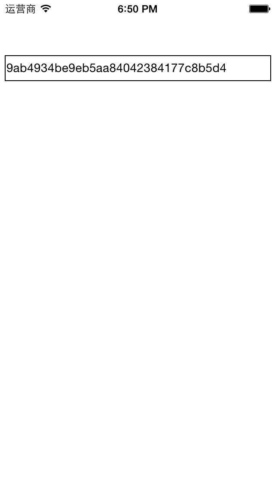

[RTID](https://github.com/rickytan/RTID)
====

# 背景
很多时候我们需要设备的唯一标识符，但自从 `iOS 5.0` 之后，苹果公司开始限制 `[UIDevice currentDevice].uniqueIdentifier` 的访问，而现在，这个接口已经被移除，多了一个新的 `identifierForVendor` 接口。对每个单独的应用，它返回一个唯一的字符串，但是应用删除重装安装后，这个字符串就变了（本人在一个 `iOS 6.1.2` 越狱设备上测试，可能会有些问题）。这样的话，统计或是作为用户身份登录都会产生问题。

## 网卡地址
读 `MAC` 地址是个不错的想法，但在目前最新的 `iOS 7.0` 中返回 **02:00:00:00** ，已经失效。即使是在 `iOS 6.0` 中，读 `MAC` 地址也是做为私有接口存在。

## OpenUDID
这是一个不错的实现，它不依赖 `iOS` 设备的任何硬件和系统中的 `ID`，而是随机生成一串字符，并保存在某处。它的限制也很明显，就是当系统升级后，或者所有用到 `OpenUDID` SDK 的应用都删除了，再安装一个新的用到 `OpenUDID` 的应用，它返回的 `UDID` 就变了。

例如，在应用 A 中调用 `OpenUDID` 接口，返回如下：

    3a2ee6eea4d427abcf7e8ce6a0463bfcacf957df
    
再安装一个 _bundle identifier_ 不同的应用 B，也返回

    3a2ee6eea4d427abcf7e8ce6a0463bfcacf957df
    
这时删除 A，返回还是一样。无论关机、重启也好。很大程度上可以保存它是设备的唯一标识。但是这时把 B 也删了了，关机重启，再安装，
就返回一个新的了：

    22f76530318d5cdad310dd2d8e89c7c03aebb82b
    
这还不算，毕竟用户把所有用到 `OpenUDID` 的应用全删除可能性不大。问题是，`OpenUDID` 的实现用到了公共剪切板，而貌似以后苹果将
限制跨应用的剪切板访问，所以最终 `OpenUDID` 也会失效！

# 需求
我们不一定需要一个设备的唯一标识，我们只要在我们自己的应用中能读到一个**唯一**、**不变**的标识，这样就可以做统计分析，或是_无帐号_系统的游戏登录（因为有帐号的话，用户很大可能就不去玩了，流失率比较高）。它应该有以下特点：

* 是自己生成的随机串，与系统硬件无关
* 只生成一次，以后每次打开读到一样的内容
* 用户删除本应用，然后重装，读到一样的内容
* 用户升级系统（不是重装系统），仍能读到一样的内容

为此，实现了 `RTID`！

# RTID
## 使用方法
在你的项目中引入 `RTID.h`，然后在编译设置中 `Other Link Flags` 中增加 `-ObjC`，可能需要添加依赖：

* Security.framework

然后就可以通过以下方式获取一个唯一且不变的 ID：

    NSString *rtid = [UIDevice currentDevice].RTID;
    
经实测，应用删除后，再重装，此 ID 依然不变。除非，重装系统！

## 风险
此实现没有调用苹果的私用接口，但本人仍无法保证用到此代码的应用能顺利上线！如果您用到了，且成功上线了，还请[告知](mailto:ricky.tan.xin@gmail.com?subject=我的应用成功上线)一下，谢谢！

## 商用
本项目开源、免费，但如果您在商用软件中用到此代码，请将您的应用下载链接及简介发送到[此邮箱](mailto:ricky.tan.xin@gmail.com?subject=我用到了RTID)，本人感激不尽！
